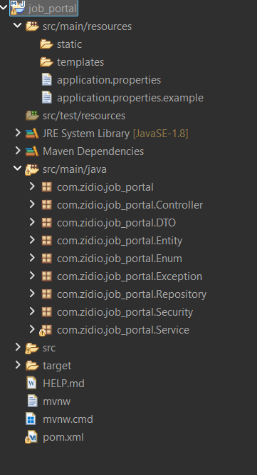

# 🌐 Zidio Connect - Job Portal 🚀  

  
  
  
  
  

A **full-stack Job Portal** platform built with **Spring Boot (Backend)** and soon to be integrated with a **React + SCSS Frontend**.  
The platform connects **Job Seekers (Employees)** and **Recruiters**, while providing **Admins** with analytics and control.  

---

## 📖 1. Overview
Zidio Connect is designed to **simplify the job application and recruitment process**.  

👨‍💻 **Employees** → Create profiles and apply for jobs.  
🏢 **Recruiters** → Post and manage job listings.  
🛠 **Admins** → Monitor platform activity via dashboards and analytics.  

This project follows a **microservices architecture** (Auth Service, Employee Service, Recruiter Service, Admin Service, etc.) with **Eureka Service Discovery** and **API Gateway**.  

---

## ✨ 2. Features
- 🔐 User Authentication & Authorization (JWT-based)  
- 👥 Role-based access: **Admin, Employee, Recruiter**  
- 📝 Employee profile management  
- 📌 Recruiter job posting & management  
- 📊 Admin analytics & dashboard  
- ☁️ File uploads with **Cloudinary**  
- 📧 Email notifications (SMTP/Gmail integration)  
- 🗄 Persistent storage with **MySQL + Hibernate/JPA**  
- 🌍 API Gateway & Eureka service discovery  

---

## 🛠 3. Tech Stack
**Backend:** Spring Boot, Spring Security, Spring Data JPA, Eureka, API Gateway  
**Database:** MySQL  
**Authentication:** JWT (JSON Web Tokens)  
**File Storage:** Cloudinary  
**Email Service:** Spring Boot Mail (Gmail SMTP)  
**Build Tool:** Maven  
**Frontend (Coming Soon):** React + SCSS  

---

## 📂 4. Project Structure


## 📥 5. Setup to run the application

1. Clone the repository

```bash
git clone https://github.com/your-username/job_portal.git
cd job_portal
```

2. Open in Spring Initializr (Optional Setup)

If you want to regenerate or reconfigure the project:

- Go to [Spring Initializr](https://start.spring.io/)
- **Project**: Maven  
- **Language**: Java  
- **Spring Boot**: 3.x.x  
- **Packaging**: Jar  
- **Java**: 17

3. Project Settings

**Dependencies to select in Spring Initializr** *(already included in this project)*:

- Spring Web  
- Spring Data JPA  
- Spring Security  
- Spring Boot DevTools  
- MySQL Driver  
- Spring Mail  
- Eureka Discovery Client  
- Spring Cloud Gateway

4. Import as Maven Project

If using **Eclipse** or **IntelliJ IDEA**:

- File → Import → Existing Maven Project  
- Select the cloned folder (`job_portal`)  
- Wait for Maven to download dependencies  

Or via command line:

```bash
mvn clean install
```

5. Configure Database

**Create a MySQL database:**

```sql
CREATE DATABASE job_portalDB;
```
**Copy the example config:**
```bash
cp src/main/resources/application.properties.example src/main/resources/application.properties
```
**Create application.properties (ignored by Git) based on the template:**
```properties
spring.datasource.url=jdbc:mysql://localhost:3306/job_portalDB
spring.datasource.username=yourUser
spring.datasource.password=yourPassword

jwt.secret=yourSecretKey
spring.mail.username=yourEmail
spring.mail.password=yourAppPassword

cloudinary.cloud_name=yourCloudName
cloudinary.api_key=yourApiKey
cloudinary.api_secret=yourApiSecret
```

6. Run the Application

**Run using Maven:**

```bash
mvn spring-boot:run
```

7. Services and Ports

Service            | Port
-------------------|------
Eureka Server      | 8761
API Gateway        | 8081
Auth Service       | 7071
Employee Service   | 7072
Recruiter Service  | 7073
Admin Service      | 7076

-Access Eureka Dashboard at:
👉 http://localhost:8761

APIs are routed through API Gateway (http://localhost:8081)

# 📬 6. API Endpoints (Test with Postman)

Here are some key endpoints *(all responses are JSON)*:

---

### 🔑 Authentication
- **Register** → `POST /api/auth/register`  
- **Login** → `POST /api/auth/login`  

---

### 👨‍💼 Employees
- **Get Employee by Email** → `GET /api/employees/{email}`  
- **Update Profile** → `POST /api/employees/update`  
- **Employee Count** → `GET /api/employees/count`  

---

### 🧑‍💻 Recruiters
- **Save / Update Recruiter** → `POST /api/recruiters/save`  
- **Get Recruiter by Email** → `GET /api/recruiters/{recruiterEmail}`  
- **Recruiter Count** → `GET /api/recruiters/count`  

---

### 💼 Job Posts
- **Create Job Post** → `POST /api/jobPosts`  
- **Get All Jobs** → `GET /api/jobPosts`  
- **Get Jobs by Recruiter Email** → `GET /api/jobPosts/recruiters/{recruiterEmail}`  
- **Search by Company Name** → `GET /api/jobPosts/search/company/{companyName}`  
- **Search by Location** → `GET /api/jobPosts/search/location/{jobLocation}`  
- **Search by Job Type** → `GET /api/jobPosts/search/type/{jobType}`  
- **Search by Job Title** → `GET /api/jobPosts/search/jobtitle/{jobTitle}`  
- **Job Count** → `GET /api/jobPosts/count`  

---

### 📑 Applications
- **Apply for Job** → `POST /api/applications/apply`  
- **Get Applications by Employee Email** → `GET /api/applications/job/email/{employeeEmail}`  
- **Get Applications by Job ID** → `GET /api/applications/job/id/{jobId}`  
- **Update Application Status** → `PUT /api/applications/status`  
- **Application Count** → `GET /api/applications/count`  

---

### 💳 Subscriptions
- **Create Subscription** → `POST /api/subscriptions`  
- **By User Email** → `GET /api/subscriptions/user/email/{userEmail}`  
- **By Employee ID** → `GET /api/subscriptions/user/employee/{employeeId}`  
- **By Recruiter ID** → `GET /api/subscriptions/user/recruiter/{recruiterId}`  
- **Get All Subscriptions** → `GET /api/subscriptions`  
- **Download Invoice** → `GET /api/subscriptions/invoice/{id}`  
- **Subscription Count** → `GET /api/subscriptions/count`  

---

### 📦 Subscription Plans
- **Add Plan** → `POST /api/plans/add`  
- **Get Plan by ID** → `GET /api/plans/{id}`  
- **Delete Plan** → `DELETE /api/plans/{id}`  

---

### 📊 Dashboard / Analytics
- **Summary Counts** → `GET /api/dashboard/summary`  
- **Weekly Applications Trend** → `GET /api/dashboard/applications/weekly`  

---

### 📩 Notifications
- **Send Email** → `POST /api/notifications/email`  

---

### 📂 File Upload
- **Upload Resume** → `POST /api/uploadFiles/resume`  
- **Upload Image** → `POST /api/uploadFiles/upload`  
- **Upload Invoice** → `POST /api/uploadFiles/invoice`  

---

### 📜 Audit Logs
- **Save Log Action** → `POST /api/auditLogs`  
- **Get Logs by Module** → `GET /api/auditLogs/log/module/{module}`  
- **Get Logs by Actor** → `GET /api/auditLogs/log/actor/{actor}`  

---

### 👮 Admins
- **Admin Count** → `GET /api/admins/count`  
